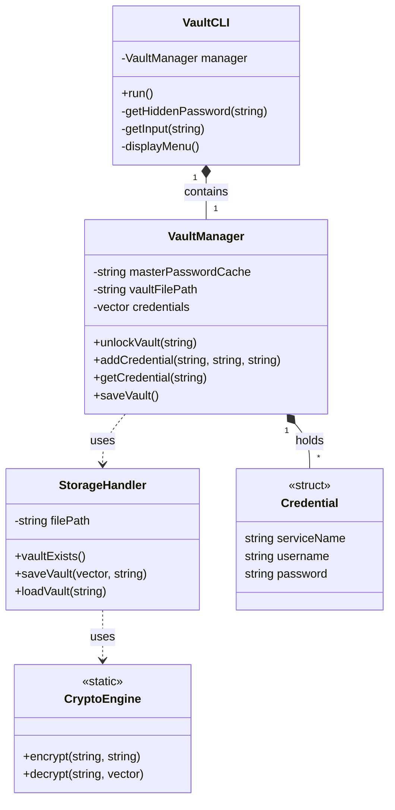

# Password Vault

A simple command-line password vault application written in C++.

## Class Diagram

```mermaid
classDiagram
    class VaultCLI {
        -VaultManager manager
        +run()
        -getHiddenPassword(string)
        -getInput(string)
        -displayMenu()
    }

    class VaultManager {
        -string masterPasswordCache
        -string vaultFilePath
        -vector<Credential> credentials
        +unlockVault(string)
        +addCredential(string, string, string)
        +getCredential(string)
        +saveVault()
    }

    class StorageHandler {
        -string filePath
        +vaultExists()
        +saveVault(vector<Credential>, string)
        +loadVault(string)
    }

    class CryptoEngine {
        <<static>>
        +encrypt(string, string)
        +decrypt(string, vector<byte>)
    }

    class Credential {
        <<struct>>
        string serviceName
        string username
        string password
    }

    VaultCLI "1" *-- "1" VaultManager : contains
    VaultManager "1" *-- "*" Credential : holds
    VaultManager ..> StorageHandler : uses
    StorageHandler ..> CryptoEngine : uses
```